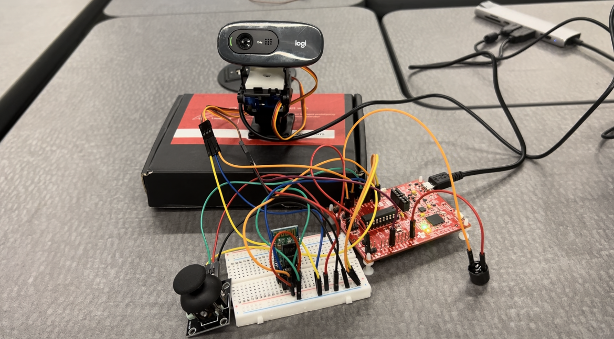

# Project Overview - SpiCAM
Our project SpiCam is a security camera module that allows users to monitor their home/room while they are away.
SpiCam features an analog joystick for which the users can control the pan and tilt motion of the camera and maximize the field of vision, capturing every angle of the room.
It also features an automatic facial detection component where a box will be drawn around the detected face for a potential intruder. 
In addition, the users can connect to SpiCam remotely through their phones via Bluetooth and set off an alarm when necessary to scare off any intruder or suspicious personnel. 

## Technical Description
The main technical components for this project can be broken down into three parts: joystick control, facial recognition, and Bluetooth Communication
### 1. Joystick Control
The power of the joystick is connected to 3.3V, X output is connected to P1.3, and Y output is connected to P1.4 of the MSP430. As the analog joystick moves in either direction, 
the voltage output in the corresponding pins changes. We use multi-channel ADC10 of the MSP430 to continuously read the voltage values and use them to map to the PWM output of P1.6 and P2.1
that are connected to the pan servo and tilt servo of the camera module respectively. The TA0CCR1 that controls the PWM of P1.6 (pan servo) is set proportional to the ADC value of the first channel (Joystick X direction) and the TA1CCR1 for P2.1 PWM (tilt servo) is set proportional to the second channel ADC value (Joystick Y direction).
### 2. Facial Recognition
The facial recognition component is written mainly in Python using the Open-CV library in [face.py](face.py). The algorithm takes the input from the camera, reads each frame, and converts the frames into greyscale for easier detection. 
The face recognition uses the CascadeClassifier provided by the Open-CV library and uses a pre-trained model [haarcascade_frontalface_default.xml](haarcascade_frontalface_default.xml). Each time a face is detected,
a bounding box around the detection is drawn and outputted to the video feed. In addition, pressing the 'ESC' key terminates the camera program. This is adapted from this [tutorial](https://www.geeksforgeeks.org/face-detection-using-cascade-classifier-using-opencv-python/).
### 3. Bluetooth Connection
To allow remote connection from users' phones to the MSP 430 board, an HC-05 Bluetooth transceiver module is used. The TX and RX of the HC-05 is connected to the P1.2 (RX) and P1.1 (TX) of the board respectively to set up USCI communication. The Baud Rate is set to 9600 for compatibility and [Bluetooth Terminal HC-05 mobile app](https://play.google.com/store/apps/details?id=project.bluetoothterminal&hl=en_US&gl=US) is downloaded. The users can connect to the HC-05 Bluetooth through the mobile app and send messages to the board. Each time the RX buffer on the MSP430 board receives a message from the phone, the USCI0RX_ISR interrupt is triggered. When the user sends a '1' over the app, the alarm which is a piezo buzzer connected to P1.0 of the board turns on. Similarly, when the user sends a '2' over the phone the alarm would then turn off. 
